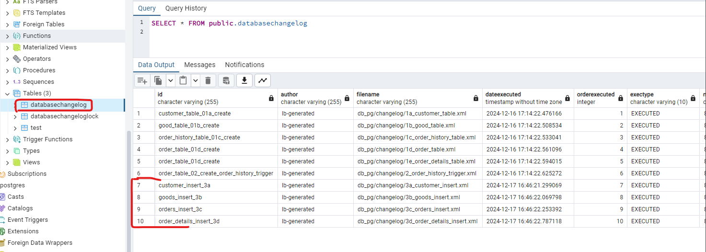

# Разворачивание postgres
Запустите командой ```docker-compose up``` в bash терминале, файл docker-compose.yml в ./docker
# Генерация данных
Данные можно сгенерировать (если нужно), после чего они сохранятся в sql файлы в директории ./db_pg/changelog
Для генерации запустить unit test DataGeneratorApplicationTest.generateInserts().
Эти данные из sql скриптов будут загружены в postgre при применении миграций один раз! Соответственно, для загрузки
в postgre еще данных, необходимо добавить новые файлы changelog с инсертами. Либо удалить в postgre в таблице databasechangelog
все строки связанные с инсертами, а затем выполнить еще раз gradle task ``update``

# Применение миграций
Миграции лежат в ./db_pg
Для применения выполнить gradle task ``update``
